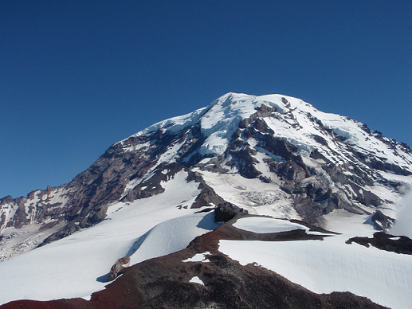
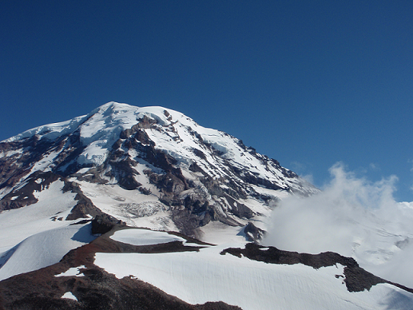
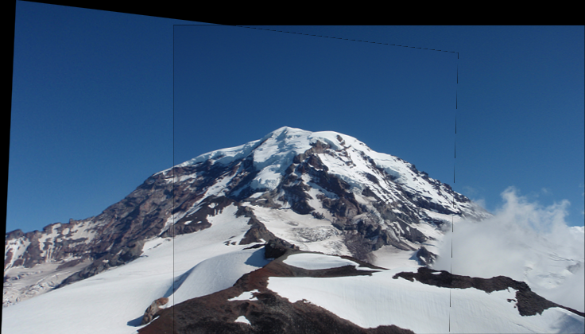

# Panorama Stitching
Create a panoramic photo by stitching multiple images together

Method:
- Use SIFT for keypoint feature detection.
- Apply RANSAC to identify the best inlier keypoint feature matches.
- Fit an homography to the best keypoints and merge the images

Input images:

 

Output Panorama:
